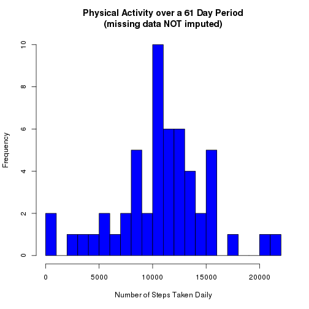
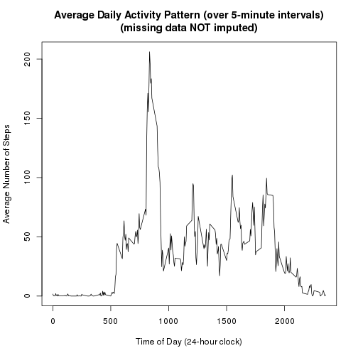
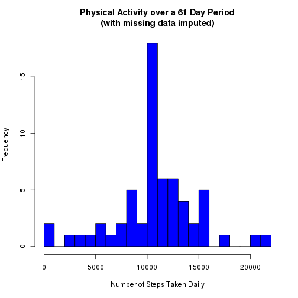
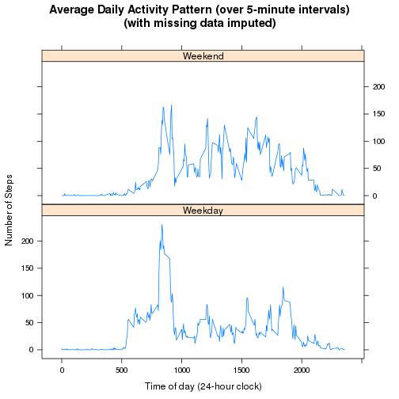

## Introduction


We find that the dataset contains time-series activity data over 61 consecutive
days, namely the months of October and November of the year 2012.  The number
of steps taken by an individual is recorded as an observation every 5 minutes.
Since there are 1440 minutes in a day, this gives us 1440/5 (=288) observations
per day. Thus, there are 288*61 (=17568) total observations.

We further observe that 8 of the 61 days contain no activity data
whatsoever. These correspond to days 1, 8, 32, 35, 40, 41, 45, and 61.
The remaining 53 days are not missing any data.

Among the remaining 53 days, we discover that the average
number of steps taken per day is 10766.19.

## Loading and preprocessing the data

Download the activity.zip file. Open an R session and use
the `setwd()` command to change into the directory containing the
downloaded file. Load the data into an R data.frame object by entering
the following at the R prompt:


```r
unzip("activity.zip")
activity_data <- read.csv("activity.csv")
```


## Summary of the dataset

In this section, we summarize some of the key features of the dataset
and provide the R code used to help make these observations.


```r
# The dataset has 17568 rows and 3 columns.
dim(activity_data)
```

```
## [1] 17568     3
```

```r
# The columns are labelled 'steps', 'date', and 'interval'. The first
# six observations reveal some information as to how the data is formatted.
head(activity_data)
```

```
##   steps       date interval
## 1    NA 2012-10-01        0
## 2    NA 2012-10-01        5
## 3    NA 2012-10-01       10
## 4    NA 2012-10-01       15
## 5    NA 2012-10-01       20
## 6    NA 2012-10-01       25
```

```r
# The data are collected over 61 consecutive days.
unique(activity_data$date)
```

```
##  [1] 2012-10-01 2012-10-02 2012-10-03 2012-10-04 2012-10-05 2012-10-06
##  [7] 2012-10-07 2012-10-08 2012-10-09 2012-10-10 2012-10-11 2012-10-12
## [13] 2012-10-13 2012-10-14 2012-10-15 2012-10-16 2012-10-17 2012-10-18
## [19] 2012-10-19 2012-10-20 2012-10-21 2012-10-22 2012-10-23 2012-10-24
## [25] 2012-10-25 2012-10-26 2012-10-27 2012-10-28 2012-10-29 2012-10-30
## [31] 2012-10-31 2012-11-01 2012-11-02 2012-11-03 2012-11-04 2012-11-05
## [37] 2012-11-06 2012-11-07 2012-11-08 2012-11-09 2012-11-10 2012-11-11
## [43] 2012-11-12 2012-11-13 2012-11-14 2012-11-15 2012-11-16 2012-11-17
## [49] 2012-11-18 2012-11-19 2012-11-20 2012-11-21 2012-11-22 2012-11-23
## [55] 2012-11-24 2012-11-25 2012-11-26 2012-11-27 2012-11-28 2012-11-29
## [61] 2012-11-30
## 61 Levels: 2012-10-01 2012-10-02 2012-10-03 2012-10-04 ... 2012-11-30
```

```r
# There are 2304 NAs in the 'steps' column.
# Each date contains 288 observations.
summary(activity_data)
```

```
##      steps                date          interval     
##  Min.   :  0.00   2012-10-01:  288   Min.   :   0.0  
##  1st Qu.:  0.00   2012-10-02:  288   1st Qu.: 588.8  
##  Median :  0.00   2012-10-03:  288   Median :1177.5  
##  Mean   : 37.38   2012-10-04:  288   Mean   :1177.5  
##  3rd Qu.: 12.00   2012-10-05:  288   3rd Qu.:1766.2  
##  Max.   :806.00   2012-10-06:  288   Max.   :2355.0  
##  NA's   :2304     (Other)   :15840
```
There are eight days having NA values in the 'steps' column.
This accounts for all 2304 (= 288 * 8) NA values in the dataset.


```r
observations_containing_NAs <- activity_data[is.na(activity_data$steps), ] ## observations with NA values
as.Date(unique(observations_containing_NAs$date)) ## list of dates containing NA values
```

```
## [1] "2012-10-01" "2012-10-08" "2012-11-01" "2012-11-04" "2012-11-09"
## [6] "2012-11-10" "2012-11-14" "2012-11-30"
```

Next, let's add a column to keep track of the day of the week.


```r
datetime <- paste(activity_data$date, sprintf("%04d", activity_data$interval)) ## merge date/time variables
day_of_week <- weekdays(strptime(datetime, format = "%Y-%m-%d %H%M")) ## get the day of week
activity_data <- cbind(activity_data, day_of_week=day_of_week) ## append day_of_week column

summary(activity_data)
```

```
##      steps                date          interval         day_of_week  
##  Min.   :  0.00   2012-10-01:  288   Min.   :   0.0   Friday   :2592  
##  1st Qu.:  0.00   2012-10-02:  288   1st Qu.: 588.8   Monday   :2592  
##  Median :  0.00   2012-10-03:  288   Median :1177.5   Saturday :2304  
##  Mean   : 37.38   2012-10-04:  288   Mean   :1177.5   Sunday   :2304  
##  3rd Qu.: 12.00   2012-10-05:  288   3rd Qu.:1766.2   Thursday :2592  
##  Max.   :806.00   2012-10-06:  288   Max.   :2355.0   Tuesday  :2592  
##  NA's   :2304     (Other)   :15840                    Wednesday:2592
```


## What is mean total number of steps taken per day?

We are interested in determining the mean and median number of
steps taken per day.


```r
# Construct a list of the number of steps taken each day
num_steps_per_day <- sapply(split(activity_data, activity_data$date), function(x) {sum(x$steps)})
```


```r
# The number of steps taken for the first 6 days is fairly consistent
# with the exception of October 2nd.
head(num_steps_per_day)
```

```
## 2012-10-01 2012-10-02 2012-10-03 2012-10-04 2012-10-05 2012-10-06 
##         NA        126      11352      12116      13294      15420
```

We use the `summary()` function to find the mean and median and discover
that among the 53 days containing activity data, the mean and median
number of steps taken is 10766.19 and 10765.00, respectively.


```r
# The 8 days lacking data are excluded from these computations.
summary(num_steps_per_day, digits = 16)
```

```
##     Min.  1st Qu.   Median     Mean  3rd Qu.     Max.     NA's 
##    41.00  8841.00 10765.00 10766.19 13294.00 21194.00        8
```


```r
# Construct a histogram of the number of steps taken daily (with
# 8 of the 61 days ignored due to missing data).
main_title <- "Physical Activity over a 61 Day Period
(missing data NOT imputed)"
xlabel <- "Number of Steps Taken Daily"
hist(num_steps_per_day, breaks = 20, main = main_title, xlab = xlabel, col = "blue")
```

 


## What is the average daily activity pattern?


```r
# Create a list of the average number of steps taken in each 5-minute interval.
avg_num_of_steps <- sapply(split(activity_data, activity_data$interval),
                    function(x) {mean(x$steps, na.rm = TRUE)})
```


```r
# The first 6 entries reveal very few steps were taken between 12:00am and 12:30am.
head(avg_num_of_steps)
```

```
##         0         5        10        15        20        25 
## 1.7169811 0.3396226 0.1320755 0.1509434 0.0754717 2.0943396
```


```r
# Construct a plot of the daily activity pattern.
main_title <- "Average Daily Activity Pattern (over 5-minute intervals)
(missing data NOT imputed)"
xlabel <- "Time of Day (24-hour clock)"
ylabel <- "Average Number of Steps"
xdata <- as.numeric(names(avg_num_of_steps))
ydata <- avg_num_of_steps
plot(xdata, ydata, main = main_title, xlab = xlabel, ylab = ylabel, type='l')
```

 

We observe that the most active 5-minute interval occurs at 8:35am, where the
average number of steps taken is approximately 206.2 steps.


```r
# most active 5-minute inteval is at 8:35am
tail(sort(avg_num_of_steps), 1)
```

```
##      835 
## 206.1698
```

## Imputing missing values
There are exactly 8 dates not having any activity data. They can be revealed by typing in the following at the R prompt.


```r
days_missing_data <- activity_data[is.na(activity_data$steps), ]
days_missing_data <- unique(cbind(as.character(days_missing_data$date),
                                  as.character(days_missing_data$day_of_week)))
colnames(days_missing_data) <- c("date", "day_of_week")
days_missing_data
```

```
##      date         day_of_week
## [1,] "2012-10-01" "Monday"   
## [2,] "2012-10-08" "Monday"   
## [3,] "2012-11-01" "Thursday" 
## [4,] "2012-11-04" "Sunday"   
## [5,] "2012-11-09" "Friday"   
## [6,] "2012-11-10" "Saturday" 
## [7,] "2012-11-14" "Wednesday"
## [8,] "2012-11-30" "Friday"
```

We observe that the dates missing data are (roughly) uniformly distributed
throughout the days of the week. Hence, if there were any particular days
of the week where the participant had an unusually high or low activity
level, this would introduce some bias into our analysis.


We will imput the missing data values by replacing NAs with the average
number of steps taken over each 5-minute interval. For example, every NA
value at 8:35am will be replaced with 206.1698 because this is the average
number of steps taken during this particular time interval.

The following code written in R will construct a new data frame (called
activity_data2) with the missing values imputed.


```r
# activity_data2 is just like the original dataset except with NAs imputed.
activity_data2 <- activity_data

# search each row for missing values, and make
# appropriate substitutions when found
for (row in 1:nrow(activity_data))
{
  # if an NA value exists, replace with avg. number of steps
  # over the 5-minute interval
  if (is.na(activity_data$steps[row]))
  {
    # new value to use
    new_val <- avg_num_of_steps[as.character(activity_data$interval[row])]
    
    # make the substitution
    activity_data2$steps[row] <- new_val
  }
}
```
After imputing the missing data, let's construct a histogram showing the
number of steps taken per day. The following code written in R generates
the histogram.

```r
main_title <- "Physical Activity over a 61 Day Period
(with missing data imputed)"
xlabel <- "Number of Steps Taken Daily"
num_steps_with_impute <- sapply(split(activity_data2, activity_data2$date),
            function(x) {sum(x$steps)})
hist(num_steps_with_impute,
     main=main_title, xlab=xlabel, col="blue", breaks=20)
```

 

By imputing the missing values in this manner, the mean number of daily
steps taken is not affected. The median is only slightly affected
(10765 before imputation, and 10766.19 after).

```r
summary(num_steps_with_impute, digits=16)
```

```
##     Min.  1st Qu.   Median     Mean  3rd Qu.     Max. 
##    41.00  9819.00 10766.19 10766.19 12811.00 21194.00
```
 
## Are there differences in activity patterns between weekdays and weekends?

First, let's add a column named "is_weekend", which tells us whether or not
the observation occurred on a weekend or weekday. For this part of the
analysis, we'll use the data frame activity_data2, where the NAs were
replaced with the average number of steps taken over each 5-minute interval.
The new column we create will be a factor variable having levels "Weekend"
and "Weekday".


```r
is_weekend <- factor(activity_data2$day_of_week == "Saturday" |
                     activity_data2$day_of_week == "Sunday",
                     labels = c("Weekday", "Weekend"))
activity_data2 <- cbind(activity_data2, is_weekend = is_weekend)

df <- as.data.frame(
           sapply(split(activity_data2, activity_data2$is_weekend),
           function(x) {sapply(split(x, x$interval),
           function(y) {mean(y$steps)})}))

df2 <- data.frame(interval = rep(sort(unique(activity_data2$interval)),2),
                  is_weekend = c(rep("Weekend", 288), rep("Weekday", 288)),
                  steps = c(df$Weekend, df$Weekday))

library(lattice)
title <- "Average Daily Activity Pattern (over 5-minute intervals)
(with missing data imputed)"
xlabel <- "Time of day (24-hour clock)"
ylabel <- "Number of Steps"
with(df2, xyplot(steps ~ interval | is_weekend, 
                 type="l", 
                 layout=c(1, 2), 
                 main=title, 
                 xlab=xlabel, 
                 ylab=ylabel))
```

 

On weekdays there appears to be a relatively high amount of activity around
8:00am - 9:00am. The activity on weekends tends to be more constant throughout
the day.


